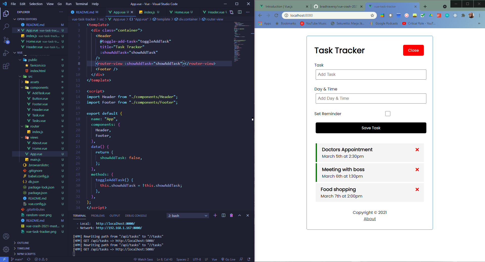
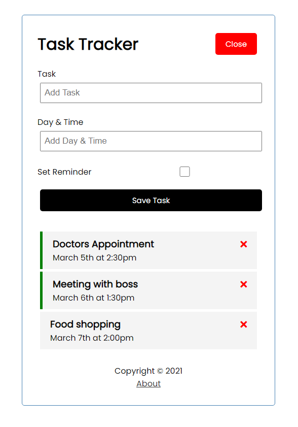

# Vue

Studying Vue and its basic principles  

https://v3.vuejs.org/guide/introduction.html  

- - - - - - -  
  
**Vue JS Crash Course 2021** (Brad Traversy) -kurssi  
  
https://www.youtube.com/watch?v=qZXt1Aom3Cs  
https://github.com/bradtraversy/vue-crash-2021  

- using Vue CDN to create first app
- using Node.js (npm) & Vue CLI (4.5.12) to create and build another Vue app  
- using Vue Developer Tools for Chrome  
- learning Vue (ver. 3.0.11) by building task tracker app  
  
Practice projects (13.4.2021):  
[Random User Generator](../master/random-user-generator):  
- create first Vue app with Vue CDN  
- get random user data using data from [Randomuser API](https://randomuser.me/)  
  
  

[Task Tracker](../master/vue-task-tracker)  (React basics)  
- create Vue app with Vue CLI  
- looking at Vue components, methods, props, emits, working with API and more  
- using npm to run dev version on localhost and build dist version  
- using [JSON Server](https://github.com/typicode/json-server) to build own REST API for task tracker app  
- using Vue SSR (vue-server) to add routing: router settings, views  
  
  
  
  
